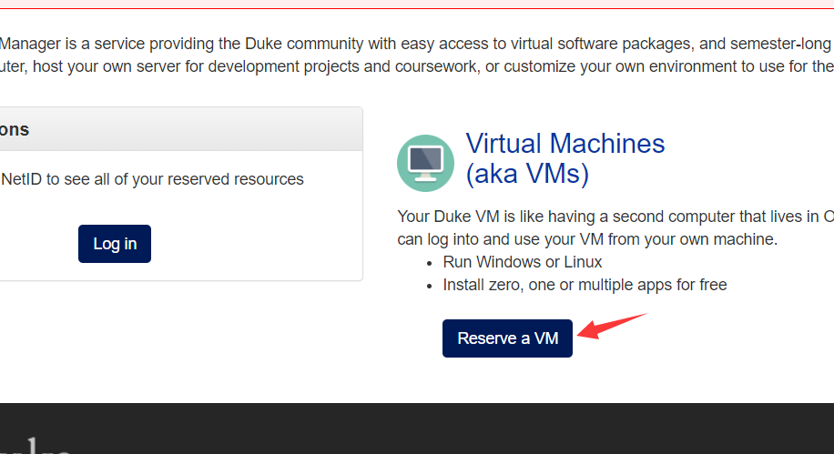
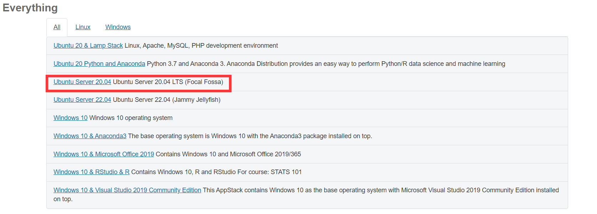
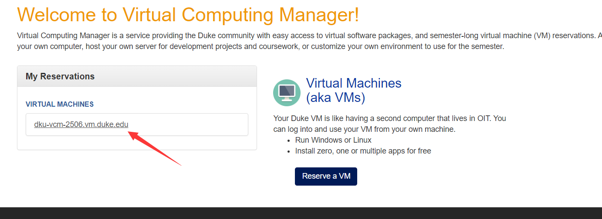
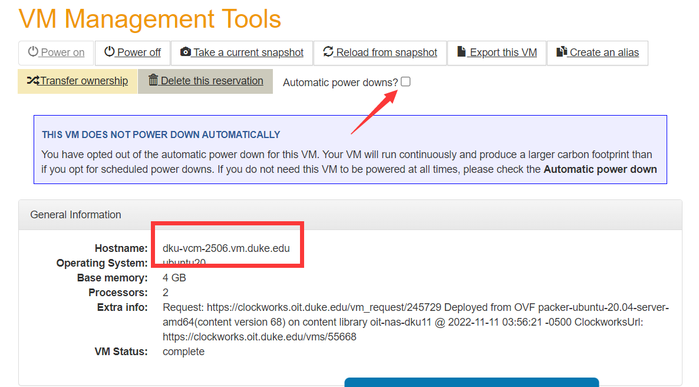
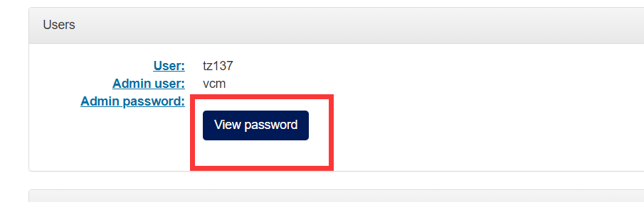

# How to Apply A Virtual Computing Manager(Remote Server)
## Apply
1. Go to the [website](https://vcm.dukekunshan.edu.cn/)
   - Under college net service;
   - Close VPN(**except anyaccess**)(you can open anyaccess, but not have to)
   - No Clush/SSR
2. Reserve one after log in:  
   
3. Ususlly Ubuntu 2004 is prefer(since ubuntu with anaconda can only gives you 2GB memory, while pure ubuntu 2004 can provide 4GB):
   
4. Waiting while reserving(as follow)...  
     
   If the server is reserved, you will receive an email.
5. go to your vcm page:
   
6. read your host name:
   
   Especially your host name, shich we will use in next steps.
   And desable daily powerdown if needed

## Basic usage
### ssh

1. open the bash(if you have git) or powershell.
2. read the necessary message in the following 
3. `ssh your_netid@your_host_name`
4. input your netid password
   - if failed for too many times, you can do this:
   - `ssh vcm@your_host_name`
   - input the vcm password:
     

Beside this, Visual studio code ssh connection is also recommended.