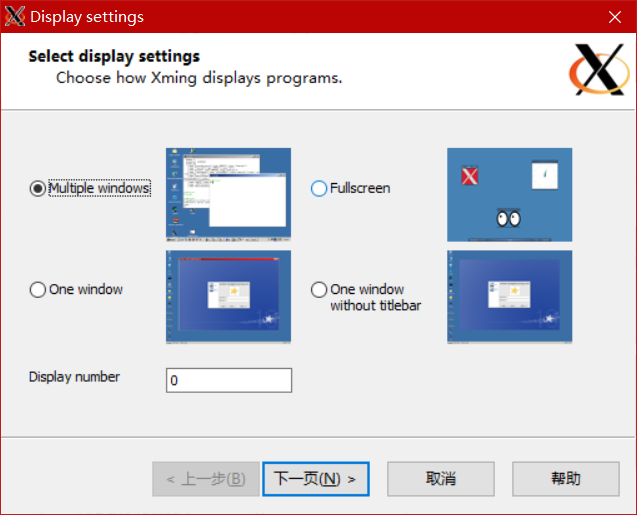
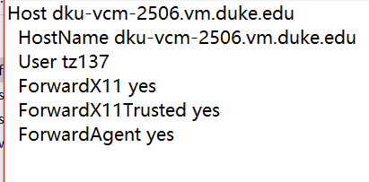

# Using ssh + vscode + Xming to display your image
## Install 'Xming' in windows
1. From [here](https://sourceforge.net/projects/xming/) down load Xming & install it.
2. Run xLunch at the start menu
3. Most of the settings should be default. Make sure the display number should be 0. as follow:
    
4. open the "X0.hosts" at the install path of xming, add yor server ip at the end of that file.
5. open your ssh config file(usually it should be ~/.ssh/config), add the following settings of your server:
    ```
    ForwardX11 yes
    ForwardX11Trusted yes
    ForwardAgent yes
    ```
    It will looks like:  
    

## vscode extensions
1. install "Remote X11 (SSH)" & "Remote X11", usually you do not need sprcific settings

## Server settings
1. `sudo vim /etc/ssh/sshd_config`, uncomment followings:
   ```
   X11Forwarding yes
   X11DisplayOffset 10
   X11UseLocalhost yes
   ```
2. `sudo systemctl restart sshd.service`
3. `vim ~/.bashrc`, add following at the end of file: `export DISPLAY=localhost:10.0`
4. `source ~/.bashrc`
5. Test: Terminal command: `Xclock`. A clock should appear on your local desktop. Install the required packages if needed.  

## Python settings
1. if: `UserWarning: Matplotlib is currently using agg, which is a non-GUI backend, so cannot show the figure.`:
   - `sudo apt install python3-tk`
   - add:
    ```
    matplotlib.use('TkAgg')
    matplotlib.use('TkAgg')
    ```
    after you import all the packages.