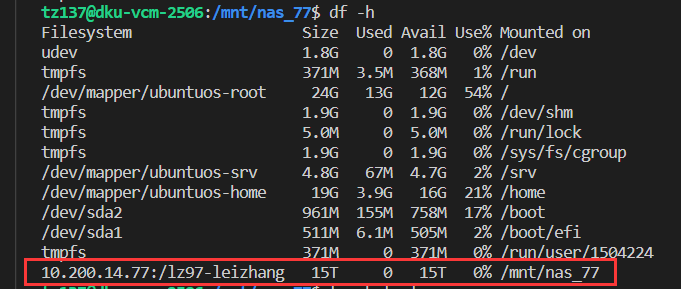

# How to mount the NAS

## Preparation
1. A computer device (Linux better)
2. **Add you ip to the firewall** (ask IT or [Tianyi](mailto:tianyi.zhang2@duke.edu))
3. Knowledge about basic linux commands
4. install nfs: 
   - `sudo apt update`
   - `sudo apt install nfs-utils -y` or `sudo apt install nfs-common -y`

# Steps
1. `cd /mnt` 
2. `mkdir nas_77`
3. `sudo mount -t nfs -o rw  10.200.14.77:/lz97-leizhang /mnt/nas_77/`
4. `cd /mnt/nas_77`
   - if `Permission denied`: `sudo chmod -R 777 nas_77/`
5. Tests:  
    - If you successfully mounted:    
        - `df -h`, it should be:  
              
    - If you can write & delete:
        - `cd /mnt/nas_77`
        - `touch test.md`
        - write something in `test.md`
        - `rm test.md`
        - There should be no conflict    

# Appendix
1. unmount: `sudo umount -l /mnt/nas_77`
2. auto mount after start up :add `10.200.14.77:/lz97-leizhang /mnt/nas_77/ nfs defaults,rw 0 0` at the end of `/stc/fstab`