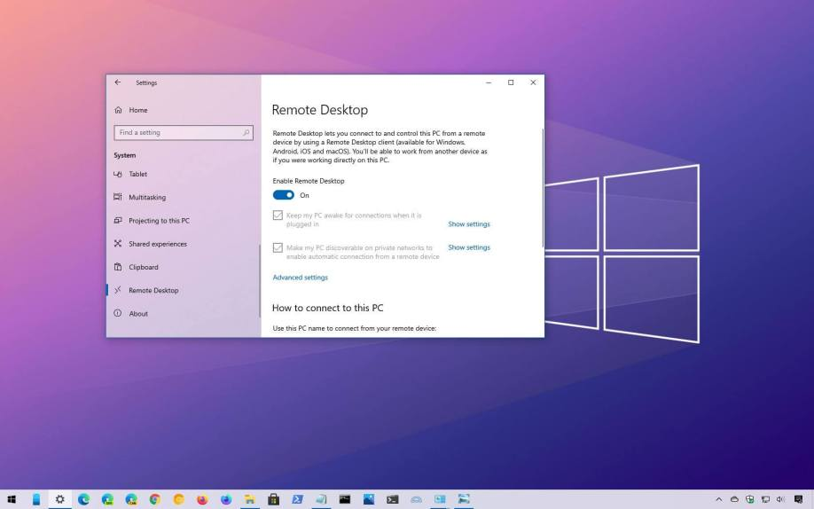
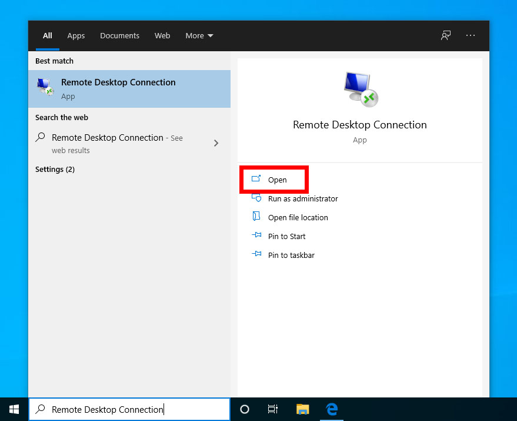
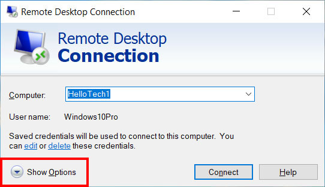
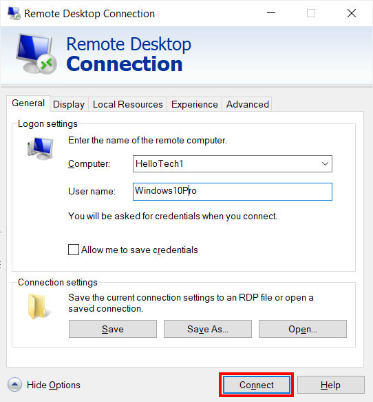
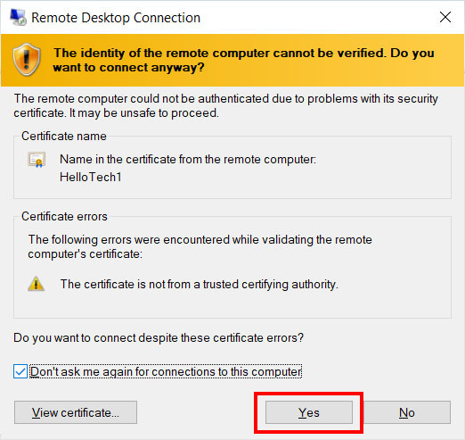

# How to remote to PC in image lab

## For Lab Computer

1. Upgrade Windows to Pro Version
There are many ways to do that. The easiest way to do this is buy a key in Taobao/Amazon or somewhere else. Then follow the instruction of producer. Usually this takes around 10 RMB.

2. Allow Remote Connect
Search in Windows Setting: "Allow remote connection to this pc", and allow it:

There are also many ways to do that. You can also search on internet to do so.

3. Allow Local Account Use Of Blank Passwords
Look at [this page](https://www.kapilarya.com/limit-local-account-use-of-blank-passwords-to-console-logon-only#:~:text=1%201.%20Press%20%2B%20R%20and%20put%20secpol.msc,policy%20setting%20to%20Enabled%20and%20click%20Apply.%20)

4. Get the ip of lab pc:
Look at [this page](https://support.microsoft.com/en-us/windows/find-your-ip-address-in-windows-f21a9bbc-c582-55cd-35e0-73431160a1b9#Category=Windows_10)

5. Remember the local account name
That should be something like:"dku001"/"dku002"/...

## For your own computer

1. Open the Windows search bar and type remote desktop connection. This is the magnifying glass icon in the bottom-left corner of your screen.Do this from the client computer or the computer that you will use to establish the remote connection.

2. Next, click Open.  

3. Then click Show Options. You can see this in the bottom-left corner of the window.  

4. Next, enter the computer’s name. This is you ip of your lab pc

5. Also, enter the username. This is the local account name.

6. Then click Connect.  

7. Next, directly click OK and do not input password.
8. Note: You might encounter a prompt asking you if you want to connect even if the identity of the remote computer cannot be identified. Just click on Yes.  

9. Finally, wait for the remote connection to be configured.   

*ref: https://www.hellotech.com/guide/for/how-to-set-up-remote-desktop-windows-10*