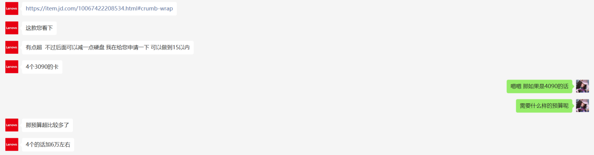

# The quotation from supplier
>[!TIP]
>This page can only be seen under DKU/DUKE web, cannot be seen from Internet

三星系列ssd由于可能有0E错误，不建议考虑，可以换成西数或希捷。国产ssd性价比很高，但商用级的可靠性有待验证。  
一下供应商从京东各个旗舰店选定，但给出报价单的单位与旗舰店名称不相符..括号里为实际报价单上的单位。
## 图灵
  
cpu比较差   
电源功率可能不够  
4卡的内存偏低  
### 6.12 第二次配置单
  
性价比还不错  
10w的是4卡平台，15w的是10卡平台，但功率支持最多只支持6卡。
## 楚霏（宽科）
  
三星硬盘可换 报价不变  
稍稍降低cpu配置，增加了一块显卡（但相比其他报价相同的单位还是cpu性能低不少）  
## 云轩（宽泛科技）
  
  
  
报价偏高，同等价位其他厂家基本能给到6卡
## 朴赛
  
电源功率有点低  
性价比不错  
注意：主板只支持4路GPU，拓展性低
  
性价比不错  
64g的内存有一定拓展性  
注意：15w的报价中cpu是2代amd，不含avx512指令集！
## 技嘉（宽泛科技）
  
A40+8366C,性能很高  

## 宽科
  
性价比不错
## 联想
  
  
智商税  
## 戴尔

  
业务能力不太行

## 总结
纸面参数来看，朴赛给出的报价性价比比较高，但是要沟通cpu可不可以更换一下。  
所以宽科的报价还不错。
类似的有技嘉155,600的报价，稍微超出一点预算。
性能来看，技嘉能在17w左右的价位给4块A40，是最高的。
一般来说，15w左右能给到4090\*6+3代8系至强\*2+256g内存的配置。10w左右能给出4090\*4+3代8系至强\*2+256g内存的配置。

# 第二轮报价
挑选了第一轮中报价比较有性价比的几家，询问了第二轮的报价。
## 朴赛
  
1. 能支持到8卡的贵18000
2. 内存现在是256G  加到512  加差价4800  加到1T  加差价14400

## 图灵
  
  
  
1. 四代至强8系列单颗差不多2-3W
2. 目前这个机器需要大概1个月的订货期  
  
销售没法太好的领会我们的意图， 不是很推荐  

## 技嘉
之前给过A40报价  
  
1. L40大概50,000RMB/每张
2. 该配置已经支持8卡
3. 9754和9684溢价太高  
  
价格不错 加了个亮机卡，考虑可能有远程桌面  

## 宽科
1. A6000或者A40的话大概19w全套（4卡）  
  

## 结论
1. CPU这边，兼容性的话，新一代的都一样，所以cpu服务器基本都以amd为主，可以考虑一台linux+一台windows，以适配MC和simulation。如果有amd不兼容的话可以去GPU的机器上跑，8336的cpu已经考虑到一定的科学计算需求了。远程桌面的话，另外提一点，最好加一张万兆网卡，远程桌面对网络要求比较高。
2. GPU的话性价比最高的是A40，相当于3090的扩显存版本，理论算力上比4090有差距，但是L40（4090的扩显存版）单卡5w左右，有点过于昂贵。个人考虑可以4090和a40搭配（比如视情况1台4090+2台a40，或2台4090+1台a40），显存足够的话可以用4090实现更快的推理速度，显存不够的话可以用a40让模型跑起来。网卡的话最好也是万兆的，如果从nas访问数据的话万兆网卡比较合适。
3. 本次配置都考虑到拓展性，包括8卡的平台为主，内存以单条64g为主，留有一半插槽以升级，价格会稍贵，因为考虑到电源风扇等设备的配套。
4. 把鸡蛋不放到一个篮子里，可以在几家供应商那里分别购买1~2台。