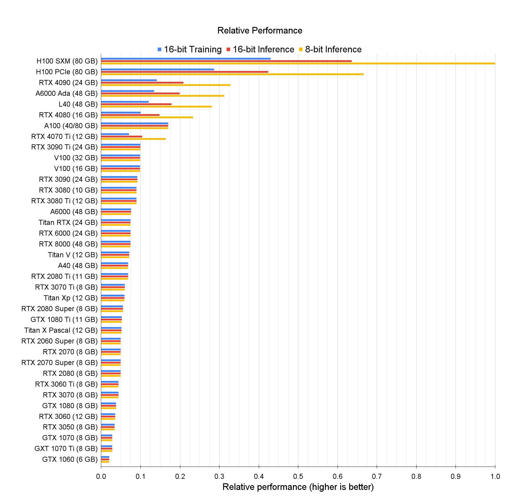

# GPU
## Ranks & tables
over all perfprmance:  

If we rank the GPUS with the cost performance ratio:  
  
And for each server, we usually put 1~8 GPUs. But ofcourse we can arrange more GPUs in 1 server.
## The best Deeplearning GPU series: H100
The latest GPU for scientific calculation, especially for Foundation Models(大模型)
 - H100 NVL: best of the best, can be bought after 2023 Q3 or Q4
 - H100 SXM: the medium one, with 80g memory. More than 260,000 RMB.
 - H100 PCIe: a little performance gap with H100 SXM, more than 240,000 RMB.

I do not think we need H100, because for medical imaging processing, most of the situation we cannot take full advantage of this kind of GPUs. And it's also too expense. If we really need these, 1~2 is enough. And it is also difficult to find in market..

## H800 (H100 China special version) 
The most significant degradation part is the connection rate of the interconnect bus, which means lower calculation speed.(And it is not so urgent if we do not use too much parallel GPUs) Also there is an around 20% off compared with H100, but still more than 200,000 each at least.

## A6000(also named RTX 6000 Ada) & A100

The A100 is clearly better, but also more expensive.  These two come actually pretty close, so either GPU is fine.
For A100, usually around 120,000 RMB, while for A6000 it is usually more than 50,000 RMB.
In addition, A100 is also banned in China, so A800 is the alternative one, with lower NVLink bandwidth(the same as H800) and around 20% off.

### L40(the latest vesion of A40)

With lower performances and lower price(less than 40,000 RMB)

##  4090

4090 is pretty effrctive for deep learning, and the prices is good(12,000~15,000 RMB).
But the main demerits except calculation ability are as follow(4090 is designed for games rather than calculation):
 - no NVLINK and PCIe P2P, which means if we use multiGPUs, the efficiency will be influenced.
 - the external communication interface bandwidth is also lower, which means lower data exchange speed and lower speed with the same calculation unit.
 - lower memory, which means the size of net is restricted.
 - no ECC, which means when running the program for a long time(a few days), the stability will loose.
 - Higher power necessary. A100 usually needs 300w, while 4090 needs 450w, so at same power supply, we can use less GPU with 4090.

And the 4090Ti(with higher performance) may be published in June.

But I think even 4090 is enough for current models we are learning.

## Ref: 
 - https://timdettmers.com/2023/01/30/which-gpu-for-deep-learning/#more-6
 - [H100](https://www.nvidia.cn/data-center/dgx-h100/)
 - [L40](https://www.nvidia.cn/data-center/l40/)  
Hint: some of the webpage from nvidia may not able to open when you have China ip, try to use abroad ip or read other materials on Internet.

# CPU

Because of MC and many other simulation demands, CPUs are also need to be consider.
We need to know, the more threads are, the less fundamental frequency is. And usually we choose more thread for server, because if we organize the code appropriately, the calculation speed for multithread system is far higher than single thread.
For CPU in server, somethme we can install more than 1 slice in one server, which is different from personal computer.  
And for scientific calculation, we need CPUs to support AVX512.
## XEON(intel)
Max series is the best among the XEON server CPUs. With 50,000 RMB~100,000 RMB each.  
For others, such as Platinum series, usually it also needs around 20,000 ~ 70,000 RMB. Specially, Platinum 8490H needs more than 120,000 RMB each.
## EPYC(AMD)
The EPYC 9004 series is also the latest ultimate version, and it usually needs 40,000 RMB ~70,000 RMB each.  

## Compare
Compared with XEON and EPYC, it is true that EPYC is much more cheaper and has better specifications on paper.  
But for software optimisation, XEON is better than EPYC, and it is wildly accepted by most of scientific packages.  
So I think for most of the situation, we need to evaluate the software, package and libraries we are using to test if we can choose the EPYC platform, since if we can use EPYC, we will spend less money to get better performance.

## Ref:
1. [Intel® Xeon® CPU Max Series](https://www.intel.sg/content/www/xa/en/products/details/processors/xeon/max-series/products.html?countrylabel=Asia+Pacific)
2. [Intel® Xeon® Platinum Processor](https://www.intel.sg/content/www/xa/en/products/details/processors/xeon/scalable/platinum/products.html?countrylabel=Asia+Pacific)
3. [Intel® Xeon® Scalable Processors Numbers and Suffixes](https://www.intel.sg/content/www/xa/en/support/articles/000059657/processors/intel-xeon-processors.html?countrylabel=Asia+Pacific)
4. [AMD EPYC Introduction](https://www.amd.com/en/processors/epyc-9004-series)
5. [AMD EPYC datasheet](https://www.amd.com/system/files/documents/epyc-9004-series-processors-data-sheet.pdf)
