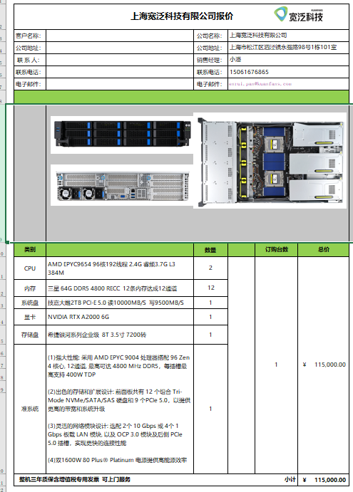
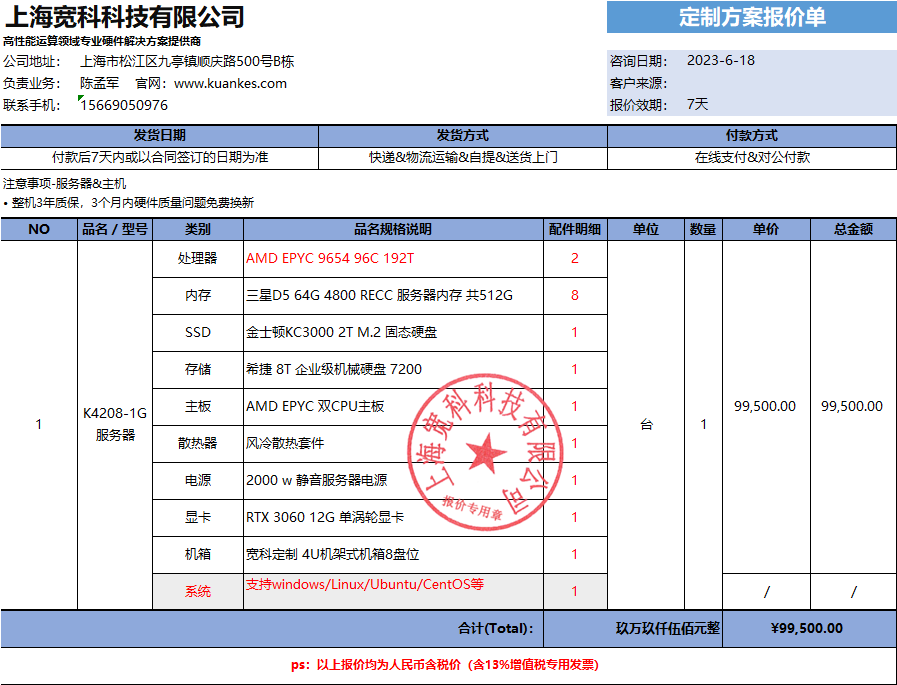
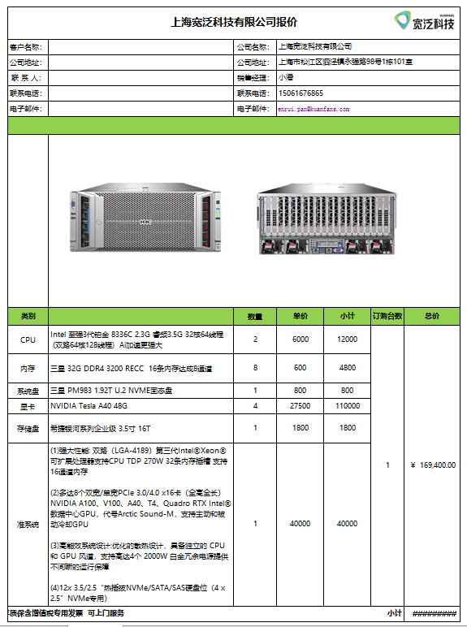
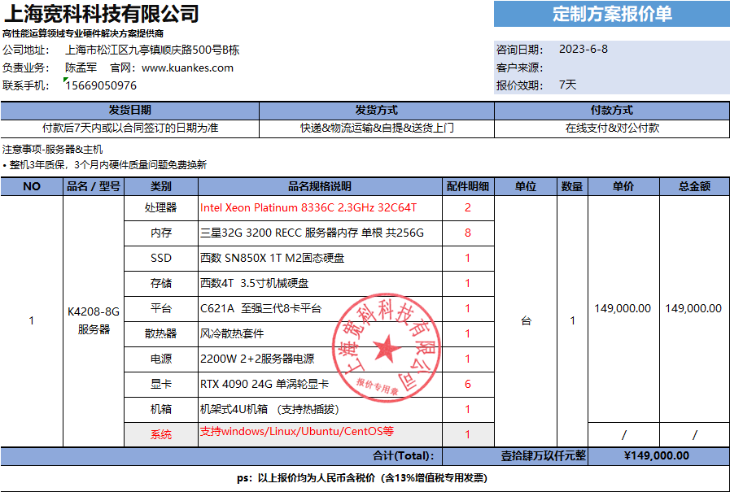
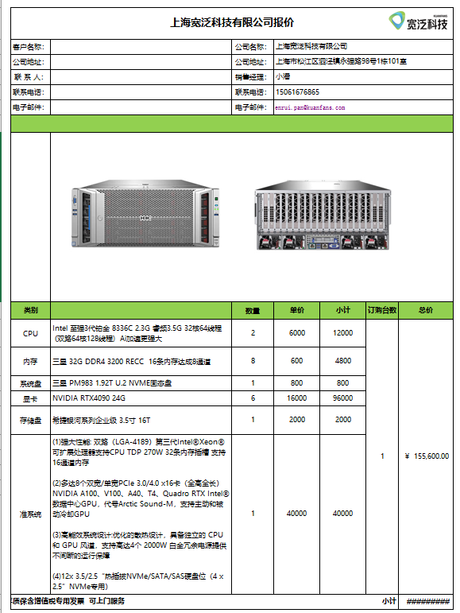
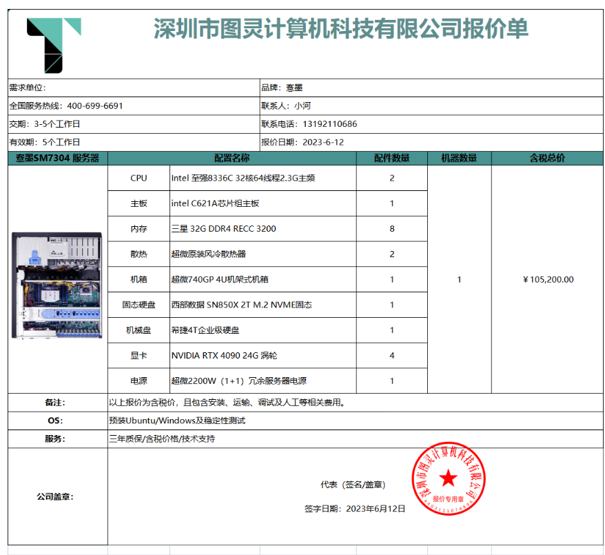

# 最终预算
1. 计算服务器（cpu为主）：amd epyc 9654（96核192线程，主频2.4G，睿频3.7G）*2 每台大概100,000~120,000RMB, 考虑购买两台，分别运行Linux和window系统
2. 深度学习A40服务器a（gpu为主）：A40*4   每台大概150,000RMB, 如果要为了拓展性支持8卡需要每台170,000~180,000RMB
3. 深度学习4090服务器b（gpu为主）：4090*4   每台大概100,000RMB, 如果要为了拓展性支持8卡需要每台120,000~130,000RMB，如果配置6卡需要每台150,000~160,000RMB
4. 深度学习3090服务器c（gpu为主）：3090*4 大概60,000~80,000RMB

说明：
1. CPU兼容性的话，新一代的都一样，所以第四代cpu服务器基本以amd为主，可以考虑一台linux+一台windows，以适配MC和simulation。如果有amd不兼容的话可以去GPU的机器上跑，8336的cpu有考虑到一定的科学计算需求了。
2. 计算GPU性价比最高的是A40，相当于3090的扩显存版本，理论算力上比4090有差距。显存足够的话可以用4090实现更快的推理速度，显存不够的话可以用a40让模型跑起来。

## 实际方案
### CPU服务器
  
包括748g内存，高速ssd，可以送一张双口万兆光口网卡+一张四口千兆网卡  
有点小贵，但扩展设计不错，还有比较冗余的电源配置  
  
内存加256g（达到748g）需要+8400  
一张双口万兆光口网卡+一张四口千兆网卡+1800  
  
可以各购买一台，以便于后续对比包括稳定性、售后等因素。  
总共需224,700RMB

### GPU服务器
#### A40(1~2台)
  
nvlink\*2 + 3000
共172,400rmb  

#### 4090(1~2台)
##### 6卡
  
  
#### 4卡

## 结论
A40\*8+4090\*6：718,500RMB  
A40\*4+4090\*12：701,700RMB  
A40\*8+4090\*4：674,700RMB  
A40\*4+4090\*8：607,500RMB  