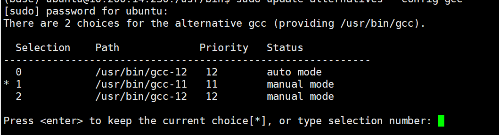

# gcc: error trying to exec ‘cc1plus‘: execvp: no such file or directory
  
是GCC和G++版本不匹配，需要二者版本一致  
一般按照cuda的版本不同，需要适配不同版本的gcc，具体参考文档[cuda installation guide](https://docs.nvidia.com/cuda/archive/11.8.0/cuda-installation-guide-linux/index.html), 而且不同的工具包也会对源代码构建进行适配，比如[tensorflow 经过测试的构建配置](https://tensorflow.google.cn/install/source?hl=zh-cn#linux)  
## 安装不同版本的gcc
```bash
sudo update-alternatives --install /usr/bin/gcc gcc /usr/bin/gcc-11 11
```
其中最后那个11表示优先级  
## 全局使用另一个版本的gcc
```bash
sudo update-alternatives --config gcc
```
  
然后用数字选择就可以了，甚至不需要重新source ~/.bashrc