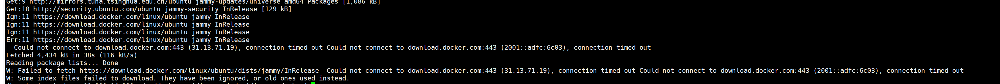

# docker官方源无法链接
when connect to download.docker.com, usually will show this:  
  
that's because china mainland **ip** cannot access docker website.(even use [proxy](./server%20users/bug_fix/proxy_related.md))  

just do this:
```bash
cd /etc/apt/sources.list.d/  
sudo mv docker.list .docker.list

# They are expired: https://hub-mirror.c.163.com; https://docker.mirrors.ustc.edu.cn; https://reg-mirror.qiniu.com; https://registry.docker-cn.com 
sudo mkdir -p /etc/docker
sudo tee /etc/docker/daemon.json <<-'EOF'
{
    "registry-mirrors": [
        "https://docker.m.daocloud.io",
        "https://dockerproxy.com",
        "https://docker.mirrors.ustc.edu.cn",
        "https://docker.nju.edu.cn"
    ]
}
EOF
sudo systemctl daemon-reload
sudo systemctl restart docker
```

