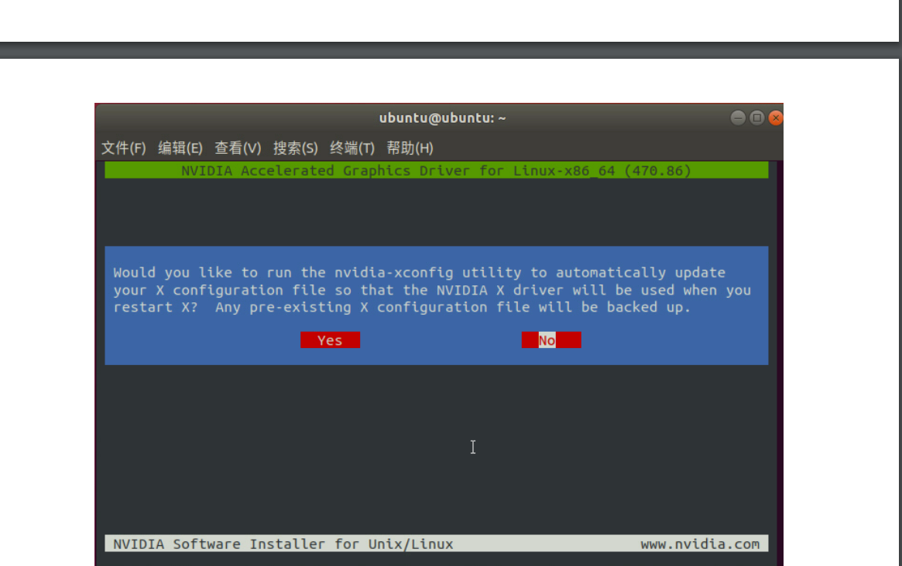

## Nvidia Driver installation
<!-- pdf has go from the root path -->
```pdf
./server maintance/ubuntu_nvidia_install/ubuntu_nvidia_driver.pdf
```
### WARNING
> [!WARNING]
> 如果偶尔掉驱动，重新执行脚本即可，即从上文第7步或第9步开始执行

供应商工程师后续提到下图选项需要选no



实测应该可以成功，但是印象不深了，可以再试一下

## CUDA and CUDnn installation

```pdf
./server maintance/ubuntu_nvidia_install/ubuntu_cuda_cudnn.pdf
```

never tested by ourselves lol