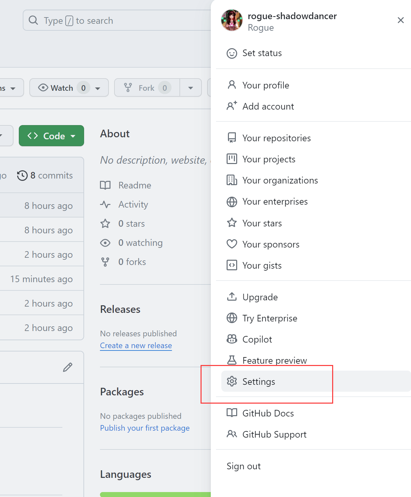
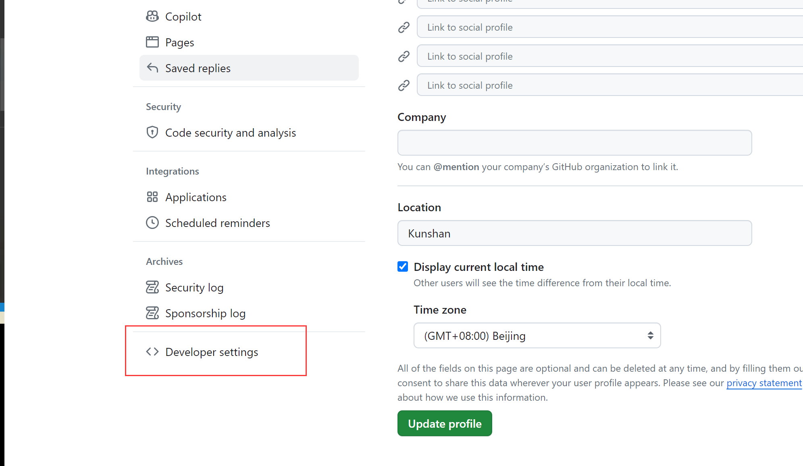
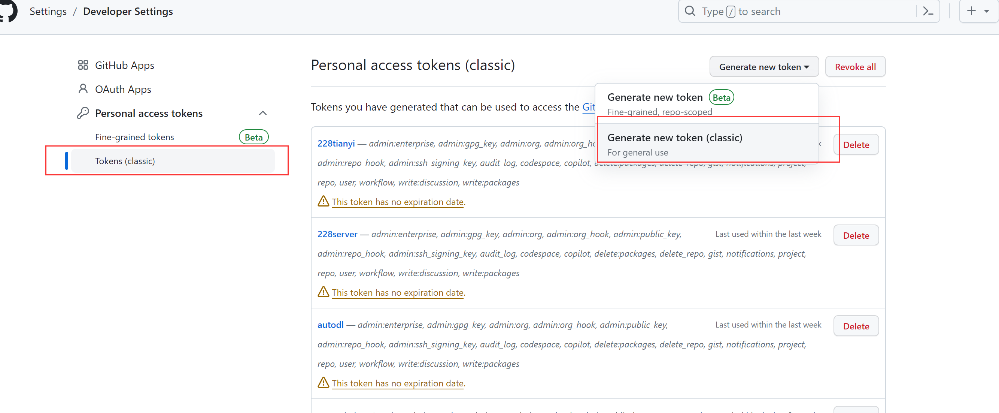
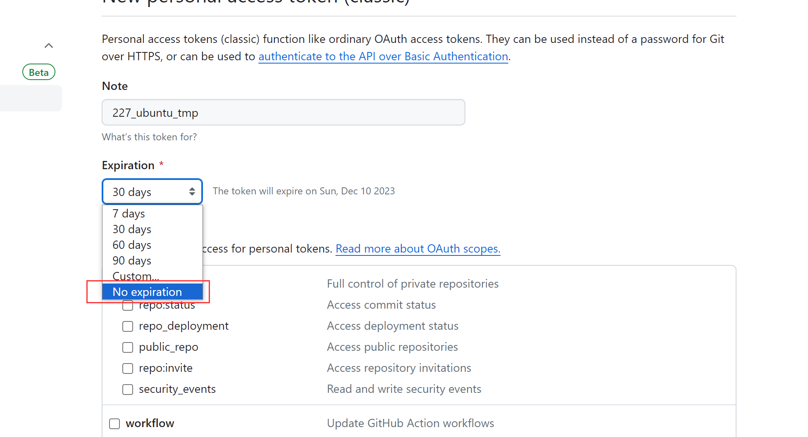
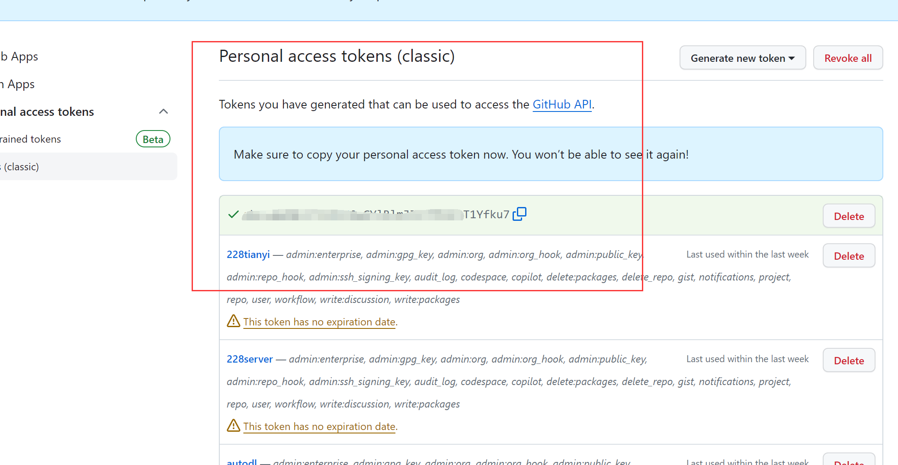

## Git
You should config your email, name of github.  
```bash
git config --global credential.helper store
git config --global user.name "your name"
git config --global user.email "your email"
```
## GitHub
you can read the document and follow the tutorials on [github website](https://docs.github.com/en/get-started/getting-started-with-git/about-remote-repositories#cloning-with-https-urls)
### If you want use the github password with no expiration
  
  
  
  
for the slection box above, is you do not know how what are these mean, just mark them all.  
  

when you clone a repo from GitHub, input your user name in, and use the token above as password. If you do that, remember to set `git config --global credential.helper store`, or you have to input the tocken each time.  
> ![attention]
> use permanent token is a unsafe behavior, may cause data safety issue.
