> [!NOTE]
> for the first time login, you **cannot** use vscode.  
## Powershell example
1. open powershell  
press "win"+"r" at the same time  
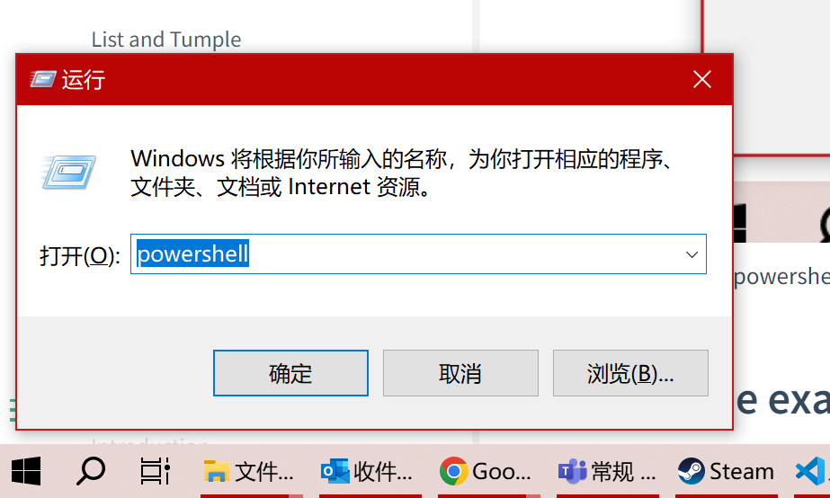  
input "powershell"  
2. ssh to server  
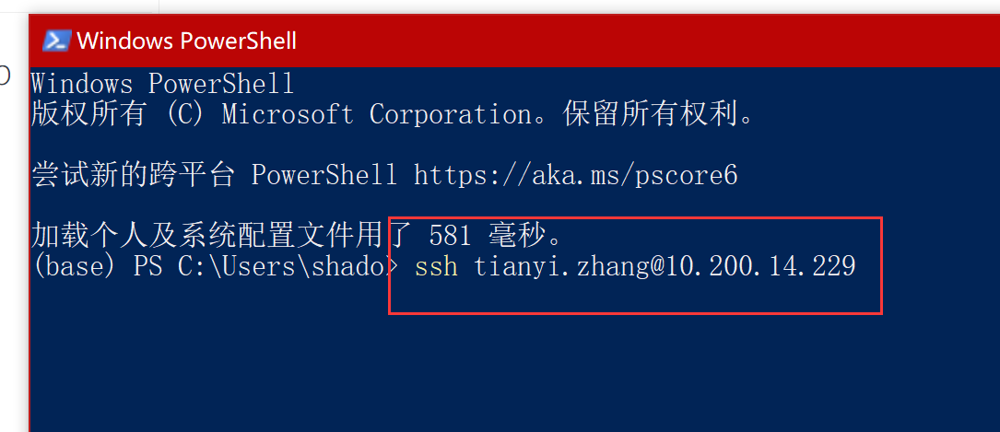  
the command format is:  
```bash
ssh your_name@server_ip
```
3. input password  
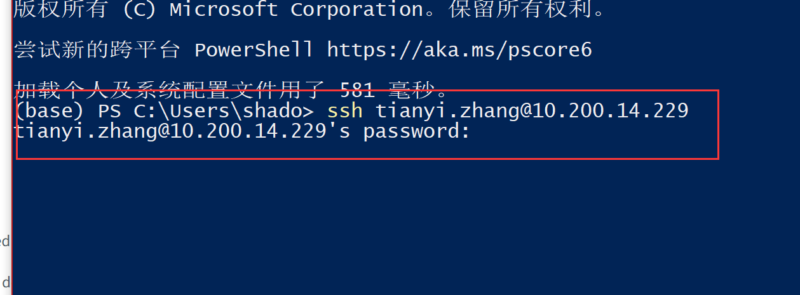  
Note: even though you input the password here, the cursor will not move, and your input will not appear on the screen.  
once you finished, just press ENTER.  
4. change the password  
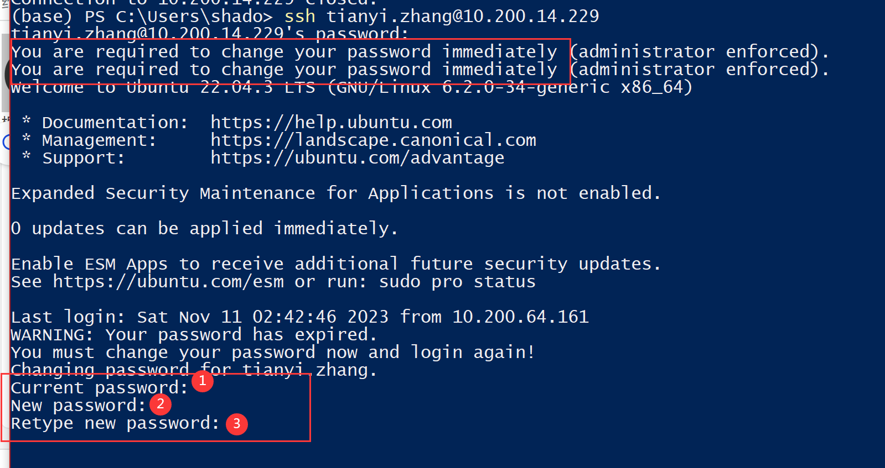  
you should use at least 8 bytes, with numbers and letters.  
then it will close the remote session:  
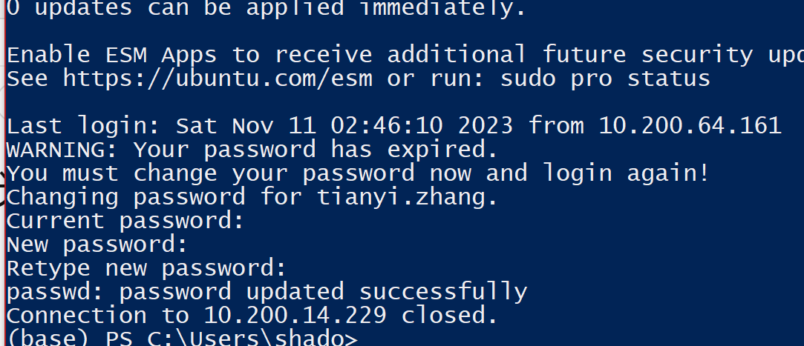  
5. relogin use your new password  
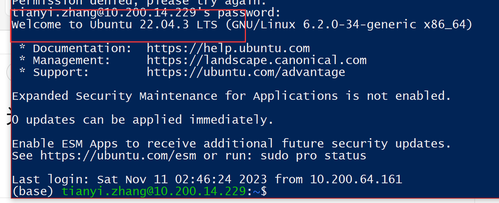  

## vscode example
1. download vscode from [official website](https://code.visualstudio.com/Download). it's free.  
2. install ssh extension:  
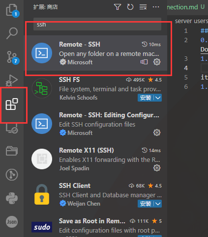  
it will automatically install several other extensions,  **donot** uninstall them.  
3. add your server:  
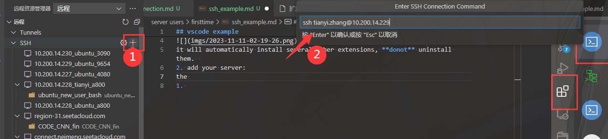  
the command format is:  
```bash
ssh your_name@server_ip
```
your user name and server ip is sent to you.  
4. select configuration file:   
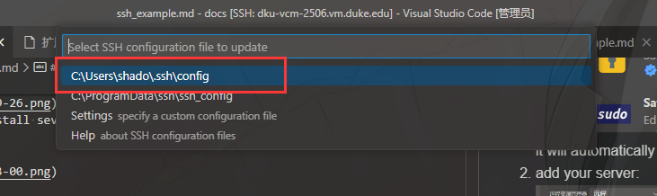    
usually the first one.  
5. refresh  
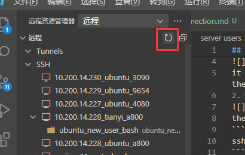  
wait about 5~10 seconds. then you will find your server here:  
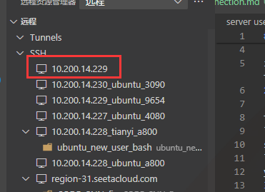  
6. open it  
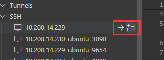  
in current window or new window, depending on your interest.  
7. select system  
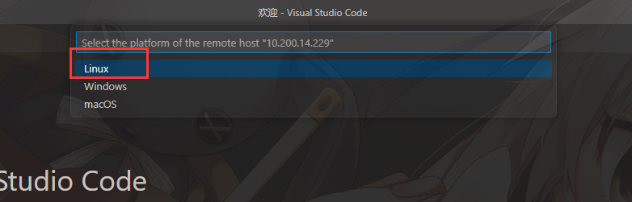  
click "Linux"  
8. enter the password  
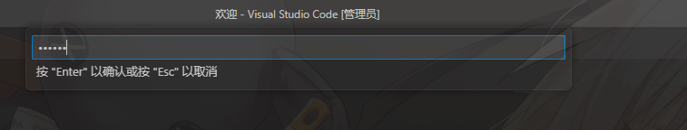  
9. wait a while  
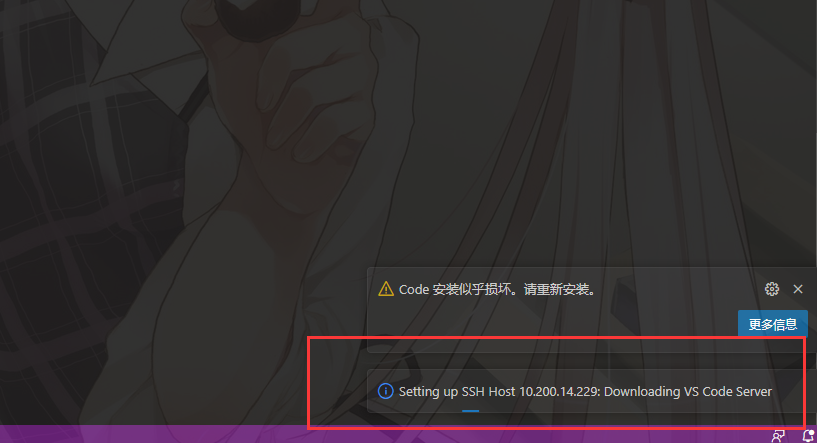  
for the first time usage, you should wait a while till the downloading in server finished(aka. the message in red box disappear).  
10. use it  
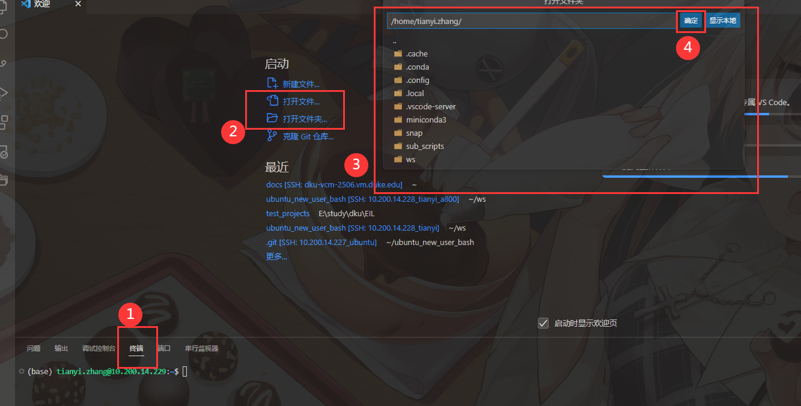  
you can click the "terminal" to open the terminal, and choose the bottom at the center to select a file or a folder. then press "confirm" to decide.  