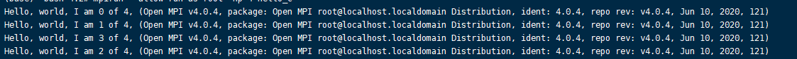
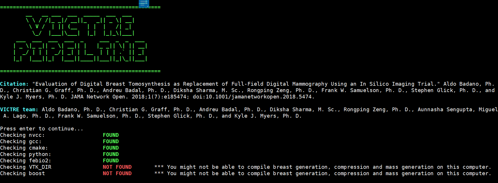
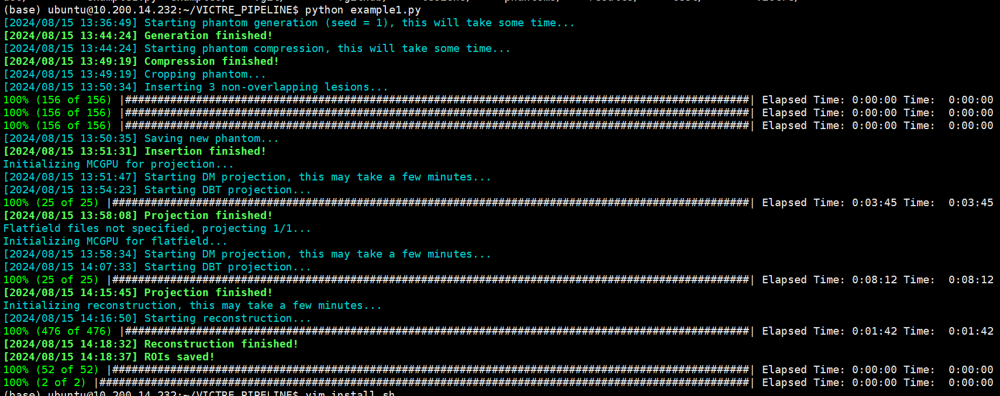

# Run the Victure Pipeline example
## Installation
follow the [introduction](https://github.com/DIDSR/VICTRE_PIPELINE?tab=readme-ov-file#installation),  
where `source install.sh` can be replaced by `bash install.sh` (here sudo is not needed).  
## febio
if your server has already installed febio(if you dont know, ask the one who let you do this), just add follow command at the end of `~/.bashrc` file and **skip this step**:
```shell
# depending on your path to febio
export PATH=/opt/FEBio-2.9.1/bin:${PATH:+:${PATH}}
```
### installation
1. download installation package
[official website](https://febio.org/febio/febio-downloads/),  
and transfer it to server  
> [!NOTE]
> download **FEBio** instead of **FEBio Studio**. the file name should be "**febio**_lnx64_2.9.1.zip" instead of "**FEBioStudio**_2.7_FEBio_4.7_Linux_installer.zip".  
> FEBio Software Developer’s Kit is not needed. (the file name should be "**FEBioSDK**-3.2-linux-x64-installer.run")
2. unzip and run the installation script  
   a. the script name is: "FEBio-2.9.1-linux-x64-installer.run", first `cd` to the script path.  
   on shell or terminal:
   ```shell
   chmod +x FEBio-2.9.1-linux-x64-installer.run
   ```
   b. for no sudo users, you have to use [rdp](./Tools/remote_to_labpc?id=for-your-own-computer) or [x11](./Tools/display_img_on_desktop) to execute the installation package. you can execute the command'./FEBio-2.9.1-linux-x64-installer.run' or directly double click the package item. then follow the "next"  

   for sudoer, rdp or x11 is not needed, script can be executed at terminal. just run `sudo ./FEBio-2.9.1-linux-x64-installer.run`, just click "next" is ok.  

   c. then add follow command at the end of your `~/.bashrc` file:
   ``` shell
   # depending on your path to febio
   export PATH=/opt/FEBio-2.9.1/bin:${PATH:+:${PATH}}
   ```

## openmpi
if your server has already installed openmpi(if you dont know, ask the one who let you do this), just add follow command at the end of `~/.bashrc` file and **skip this step**:
```shell
MPI_HOME=/usr/include/openmpi
export PATH=${MPI_HOME}/bin:$PATH
export LD_LIBRARY_PATH=${MPI_HOME}/lib:$LD_LIBRARY_PATH
export MANPATH=${MPI_HOME}/share/man:$MANPATH
```
### download and installation
1. download from [official website](https://www.open-mpi.org/)   
2. unzip: 
   ```
   tar zxf openmpi-5.0.5.tar.gz
   ```
3. build
```shell
cd openmpi-5.0.5
# dont change the path
./configure --prefix=/usr/include/openmpi
make
sudo make install
```
4. config
```shell
MPI_HOME=/usr/include/openmpi
export PATH=${MPI_HOME}/bin:$PATH
export LD_LIBRARY_PATH=${MPI_HOME}/lib:$LD_LIBRARY_PATH
export MANPATH=${MPI_HOME}/share/man:$MANPATH
```
5. test
```shell
cd openmpi-5.0.5/examples
make
mpirun -np 4 hello_c
```  
it should be sth like:  
  

## cuda sample
if your server has already installed cuda sample(if you dont know, ask the one who let you do this), just  **skip this step**
### download and modification
1. cuda should be installed correctly on each server, but cuda sample is needed:  
goto [cuda sample github repo](https://github.com/NVIDIA/cuda-samples/releases)
download the version that fits your cuda version
2. move the samples folder
```shell
# this time build is not needed
sudo cp -r cuda-samples /usr/local/cuda-11.8/
cd /usr/local/cuda-11.8/
sudo mv cuda-samples samples
```
3. modify the files:
```shell
cd /usr/local/cuda-11.8/samples/Common
```
modify the follow includes of `helper_functions.h`:  
from:  
```cpp
...
#include <exception.h>
...
#include <helper_image.h>  // helper functions for image compare, dump, data comparisons
#include <helper_string.h>  // helper functions for string parsing
#include <helper_timer.h>   // helper functions for timers
...
```
to:  
```cpp
...
#include </usr/local/cuda-11.8/samples/Common/exception.h>
...
#include </usr/local/cuda-11.8/samples/Common/helper_image.h>  // helper functions for image compare, dump, data comparisons
#include </usr/local/cuda-11.8/samples/Common/helper_string.h>  // helper functions for string parsing
#include </usr/local/cuda-11.8/samples/Common/helper_timer.h>   // helper functions for timers
...
```
modify the follow includes of `helper_cuda.h`:  
from:  
```cpp
...
#include <helper_string.h>
...
```
to:  
```cpp
...
#include </usr/local/cuda-11.8/samples/Common/helper_string.h>
...
```
modify the follow includes of `helper_timer.h`:  
from:  
```cpp
...
#include <exception.h>
...
```
to:  
```cpp
...
#include </usr/local/cuda-11.8/samples/Common/exception.h>
...
```
modify the follow includes of `helper_image.h`:  
from:  
```cpp
...
#include <exception.h>
...
#include <helper_string.h>
...
```
to:  
```cpp
...
#include </usr/local/cuda-11.8/samples/Common/exception.h>
...
#include </usr/local/cuda-11.8/samples/Common/helper_string.h>
...
```
## edit on VICTRE PIPELINE
```shell
cd VICTRE_PIPELINE/Victre/projection/
```
modify the follow includes of `MC-GPU_v1.5b.h`:  
from:  
```cpp
...
#include <mpi.h>
...
#include <helper_functions.h>
#include <helper_cuda.h>
...
```
to:  
```cpp
...
#include </usr/local/openmpi/include/mpi.h>
...
#include </usr/local/cuda-11.8/samples/Common/helper_functions.h>
#include </usr/local/cuda-11.8/samples/Common/helper_cuda.h>
...
```

## compile VICTRE PIPELINE
1. go to VICTRE PIPELINE folder:
   ```shell
   cd VICTRE_PIPELINE
   ```
2. run install script:
   ```shell
   bash install.sh
   ```
   sth shoule like:  
     
   press enter:  
     
   compile all of the items above.
   > [!ATTENTION]
   > for the compilation of `4. MCGPU projection`, you should choose `5. Ampere: RTX 30X0, RTX A6000, Tesla A100` and `n` in `Compile with MPI support? (y/n):`
## run test
```shell
   cd VICTRE_PIPELINE
   cp examples/example1.py .
   python example1.py
```
sth should be like this:  
  

## TODO
1. add mpi support
2. config VICTRE as a python package
3. config one time support for all users